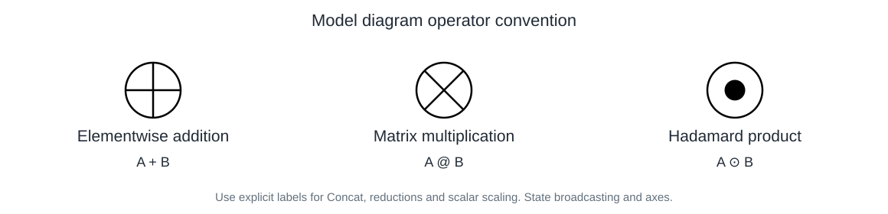

# 科研模型绘图 · Research Model Diagrams

让模型图同时说清楚：**模块层级、数据形态、维度变化与数学运算**。

这是从 [CCFA-Skills](https://github.com/mikubaka88/CCFA-Skills) 的科研视觉工作流出发、针对反复迭代模型图的需求编写的独立 Skill。适合论文方法图、核心算法图，以及后续在 PowerPoint 中手工重画的参考稿。

它不绑定某个模型、数据集、固定模块数量或图像生成服务，也不需要安装完整 CCFA。

## 这份 Skill 的专属偏好

| 绘图需求 | 固化的行为 |
|---|---|
| 总览和组件必须有层级 | 两张主图沿用模块 ID、名称、配色和输入输出接口 |
| 不同路线不能错合并 | 分清特征时点、任务、最终输出与局部表征 |
| 能看出数据格式和维度 | 同时呈现 shape 与矩阵、token、切片等图形 |
| 中间过程可视化 | 展示真实 mask、特征列、RBF/shape 曲线、成员统计和广播 |
| 连线体现数学逻辑 | 运算节点接收独立操作数，注明拼接/聚合轴 |
| 各部分有论文参考 | 精确到论文版本、图号、局部画法和改绘动作 |
| 打磨时不要回退 | 修改前记录正确内容，修改后检查有无丢失 |
| 不要多个混乱版本 | 默认两张规范图，预览与源文件属于同一版本 |
| 讨论时不要动图 | 明确区分绘图、解释、参考检索和创新性讨论 |
| 模块命名要学术准确 | 名称对应机制，组件数量和重新命名不证明创新 |

## 快速使用

把整个 `research-model-diagrams` 目录作为一个 Skill 导入支持 `SKILL.md` 的智能体环境，保持相对路径完整。具体发现目录和启用方式按宿主环境的说明操作。

若环境没有 Skill 自动发现能力，先让智能体读取 [SKILL.md](SKILL.md)，再提供模型代码、方法描述或已有图稿。可用文件、浏览、绘图与预览工具决定具体交付能力。

```text
使用 $research-model-diagrams。
以我提供的最终模型代码和配置为依据，绘制总览图和核心算法组件图。
两张图按模块编号对应，展示输入输出、中间张量和维度变化，
在实际运算处使用明确的数学节点，并给出参考论文的具体图号与改绘说明。
我会手工用 PPT 重画。更新同一份规范图稿，不改模型实现。
```

完整 Prompt 与“只讨论”“只找参考”“定向改图”模板见 [Prompt 库](references/prompt-library.md)。

## 数学运算节点



这些是显式约定的计算图符号：圆内十字表示逐元素加法、斜叉表示矩阵乘法、实心点表示 Hadamard 乘法。图中应保留图例。拼接、标量缩放和聚合采用清楚的文字/公式标签。

## 工作流

1. 从最终实现和配置提取真实输入、输出、分支、张量及运算。
2. 建立总览模块与细节面板的接口映射。
3. 核验参考论文的具体图号，提取可借鉴的表达方式。
4. 绘制数据形态、维度变化与数学节点。
5. 检查实际渲染和修订前后保留项，再交付规范文件。

精确图优先沿用或创建可编辑矢量源；概念图或位图需求可使用宿主图像工具。工具不可用时如实说明限制，不虚报图像模型名称或“可编辑”属性。

## 可选形状检查

Python 3.10+，仅标准库：

```bash
python scripts/check_shapes.py assets/shape-example.json --strict
python -m unittest discover -s tests -p "test_*.py"
```

检查矩阵乘法、广播、拼接、聚合、转置、reshape 与标量缩放。未知符号关系或不支持的操作标为 `REVIEW`，不冒充通过验证。[格式与边界](references/shape-checker.md)

形状检查不证明模型语义正确，也不检查图形遮挡。示例 JSON 是合成的符号演示，不能替代用户方法。

## 文件结构

```text
research-model-diagrams/
├── SKILL.md
├── agents/openai.yaml
├── references/
│   ├── method-contract.md
│   ├── visual-grammar.md
│   ├── reference-mapping.md
│   ├── rendering-revisions.md
│   ├── prompt-library.md
│   └── shape-checker.md
├── scripts/check_shapes.py
├── assets/
│   ├── operator-legend.svg
│   └── shape-example.json
├── tests/
│   ├── test_shapes.py
│   └── behavior-cases.md
├── README.md
├── NOTICE.md
└── LICENSE
```

`agents/openai.yaml` 是可选的宿主 UI 元数据；正文与资源不依赖该文件。

## 单独上传 GitHub

此目录可以直接作为独立仓库根目录：`SKILL.md`、`README.md`、`LICENSE` 与资源目录处于同一层。

解压发布包后，将 `research-model-diagrams` 内的内容上传到自己的新仓库即可。不要把本机模型项目、私有实验记录或上层工作区一起上传。本包不包含这些内容。

本项目使用 MIT 许可证。来源说明与 CCFA 的关系见 [NOTICE.md](NOTICE.md)。准备发布包不等于已经执行 GitHub 发布。

## 来源与致谢

感谢 CCFA-Skills 提供科研工作流、方法图组织和可编辑视觉产物方面的参考。CCFA-Skills 的许可证和版权信息见 [其 LICENSE 文件](https://github.com/mikubaka88/CCFA-Skills/blob/main/LICENSE)；本项目的独立性说明见 [NOTICE.md](NOTICE.md)。
